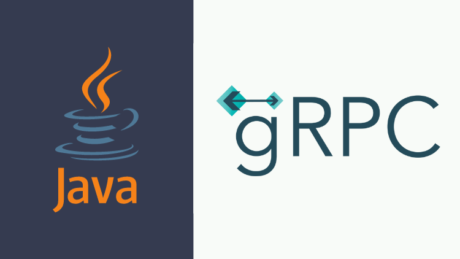

# gRPC With Spring Boot

This repoistory contains the source code for my [**gRPC With Spring Boot**](https://www.udemy.com/course/grpc-the-complete-guide-for-java-developers/) course on Udemy.

Embark on a transformative journey with Mastering gRPC a comprehensive course designed to empower you with the skills to build high-performance microservices using cutting-edge technologies — Protocol Buffers and Spring Boot. Dive into the world of gRPC and discover how this revolutionary technology can elevate your microservices architecture, achieving up to 10 times the performance compared to traditional REST-based communication.

# Topics Covered:

- Protocol Buffers (Protobuf):
  - Master Protobuf from scratch, understanding Google's language-neutral and platform-neutral serialization format for structured data.
-  Introduction to gRPC:
   - Explore the benefits of gRPC for microservices communication.
   - Delve into the different RPC types supported by gRPC, including Unary API, Client Streaming API, Server Streaming API, and Bidirectional Streaming API.
- Load Balancing:
  - Address challenges in load balancing with gRPC.
  - Explore various load balancing strategies and implement them with gRPC.
- Authentication:
  - Implement user session token passing for authentication in gRPC.
  - Explore client service token passing for authorization in gRPC.
- Error Handling:
  - Master error handling techniques in gRPC.
  - Utilize Protobuf OneOf for error handling and explore error handling through exceptions.
- Spring Boot Integration:
  - Integrate gRPC seamlessly with Spring Boot microservices.
  - Develop multiple services and ensure smooth integration between them
- Best Practices and Real-World Considerations:
  - Discuss best practices for gRPC-based microservices development.
  - Address real-world challenges and considerations in gRPC implementations.

Join this course and unlock the power of gRPC to build highly performant, scalable, and efficient microservices using Protocol Buffers and Spring Boot. Gain the skills necessary to overcome common challenges in microservices communication, achieve superior performance, and streamline your API design with gRPC.